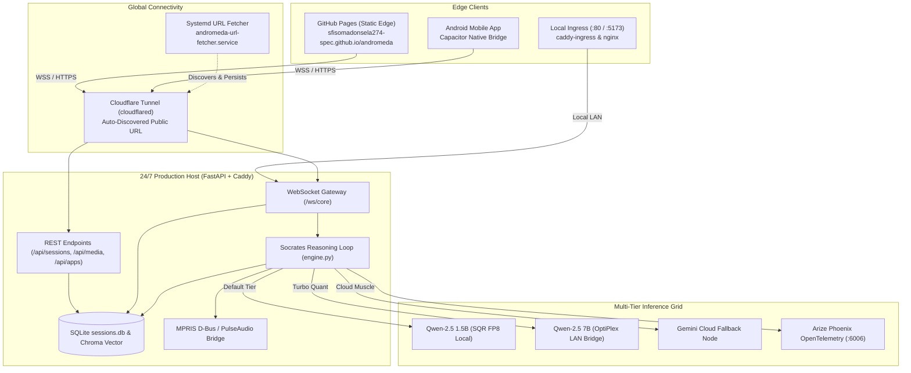

# 🌌 Andromeda // Intelligent Workspace

<div align="center">


**An Edge-Native, Spatial AI Agent and Neumorphic Operating Workspace.**  
Seamlessly blending local SLM inference, desktop hardware bridges, and real-time observability into a calm, astigmatism-ergonomic soft UI.

[](https://sfisomadonsela274-spec.github.io/andromeda/)
[](https://github.com/sfisomadonsela274-spec/andromeda)
[](https://cloudflare.com)
[](http://localhost:6006)
[](https://sfisomadonsela274-spec.github.io/andromeda/)
[](LICENSE)

[Live Web Demo](https://sfisomadonsela274-spec.github.io/andromeda/) • [Architecture](#-system-architecture) • [Getting Started](#-getting-started) • [Deployment](#-247-production-deployment) • [API & Sockets](#-api--websocket-reference)

---

</div>

## 📖 Overview

**Andromeda** is an autonomous, multimodal spatial assistant designed for zero-latency developer workflows and daily desktop computing. Unlike conventional conversational bots confined to isolated browser text boxes, Andromeda acts as a tactile desktop agent capable of controlling local media, executing terminal and Flatpak operations, managing long-term memory, and orchestrating local and cloud AI models.

Built from the ground up with **Neumorphism (Soft UI)**, the entire interface is clinically calibrated for users with astigmatism: eliminating high-contrast "halation" flares, harsh 1px tacky borders, and saturated neon lights in favor of gentle dual-diffuse shadows on a soothing slate surface (`#1e2126`).

---

## 🏛 System Architecture



---

## ✨ Key Capabilities

### 1. 🎛 Neumorphic Soft UI (Astigmatism-Ergonomic)
- **Soothing Slate Canvas (`#1e2126`)**: Avoids pupil dilation and corneal light bleed caused by high-contrast pure black (`#000000`) backgrounds.
- **Directional Diffuse Shadows**: Components emerge organically from the slate surface using directional light reflections (`-4px -4px 10px #282c34`) and soft shadows (`4px 4px 10px #131518`), completely eliminating sharp 1px borders.
- **Debossed Precision Wells**: Search bars, prompt inputs, and slider tracks are physically carved into the interface (`.neu-inset-deep`).
- **Desaturated Mineral Palette**: High-glare neon purples and cyans are replaced with Ceramic Sage (`#5e937d`), Slate-Cobalt (`#5072a7`), and Warm Ochre (`#b88a44`).

### 2. 🏝 Header Dynamic Island HUD
- Compact, tactile pill in the top navigation bar with animated real-time audio visualizer waves and track state ticker.
- Clicking the Dynamic Island expands a floating **Control Center Dropdown** with MPRIS playback transport (previous, play/pause, next), volume slider, and video embeds.

### 3. ⚡ Slash Command Palette (`/`)
- Type `/` into the prompt bar to trigger instant actions:
  - `/music <query>` &rarr; Stream audio via MPRIS or YouTube.
  - `/email <recipient>` &rarr; Stage formatted client emails with Gmail Web & mailto triggers.
  - `/install <app>` &rarr; Search and execute Flathub/Flatpak application installs.
  - `/status` &rarr; Run hardware diagnostics and RAM health checks.
  - `/model` &rarr; Hot-switch between 1.5B Local and 7B Turbo LAN inference nodes.

### 4. 🗑 Real-Time Chat Deletion & Management
- Individual conversations in the sidebar feature dedicated tactile delete buttons (`trash-2`).
- A quick "Delete Current Chat" button in the top bar allows immediate purging of active sessions.
- Synced instantaneously across SQLite (`sessions.db`) and client WebSockets with zero page reload.

### 5. 🎵 Native Desktop & System Hardware Bridges
- **MPRIS Desktop Controller**: Native Linux D-Bus integration for Spotify, VLC, and browser audio.
- **Flathub Sandbox Integration**: Generates and copies verified Flatpak terminal commands for apps like VSCode, Discord, OBS, Blender, and GIMP.
- **Optics OCR Sensor**: Screen and image text extraction powered by on-device computer vision.
- **Acoustic Audio Feedback**: Subtle tactile sound cues synthesized via Web Audio API for clicks, mode switches, and sweeps.

---

## 🛠 Technology Stack

| Layer | Technology | Purpose |
| :--- | :--- | :--- |
| **Frontend** | Vanilla HTML5, ES6+, Tailwind CSS (CDN), Lucide Icons | Zero-build fast delivery, lightweight footprint |
| **Styling** | Custom Neumorphic CSS Tokens | Directional diffuse lighting, debossed wells, zero glare |
| **Backend** | Python 3.11, FastAPI, Uvicorn, WebSockets | Asynchronous event loop, streaming, and tool execution |
| **Database** | SQLite3 (`sessions.db`), ChromaDB (`vector_store`) | Persistent conversational history & semantic memory |
| **Observability**| Arize Phoenix, OpenTelemetry, Jimmy Tracing | Token latency, KV-cache compression, agent tracing |
| **Inference** | Ollama, TensorRT, Qwen-2.5 SLMs | Low-memory edge reasoning and high-throughput scaling |
| **Reverse Proxy**| Caddy 2, Nginx Alpine | Automatic HTTPS, reverse proxying, and static caching |
| **Tunneling** | Cloudflare Zero Trust (`cloudflared`) | Secure public inbound routing without open router ports |
| **Packaging** | Docker, Docker Compose, Capacitor | Containerized microservices & native Android deployment |

---

## 🚀 Getting Started

### Prerequisites
- **Linux** (Ubuntu/Debian recommended) or macOS / WSL2
- **Docker** & **Docker Compose** (v2+)
- **Python 3.11+**
- **Ollama** (optional for local offline SLM inference)

### 1. Clone the Repository
```bash
git clone https://github.com/sfisomadonsela274-spec/andromeda.git
cd andromeda
```

### 2. Local Python Environment (Optional Dev Setup)
```bash
python3 -m venv venv
source venv/bin/activate
pip install -r andromeda/backend/requirements.txt
```

### 3. Run Locally via Docker Compose
```bash
docker compose up -d --build
```
Once started, open your browser to:
- **Andromeda Workspace**: [http://localhost:80/](http://localhost:80/)
- **FastAPI API & Docs**: [http://localhost:8000/docs](http://localhost:8000/docs)
- **Arize Phoenix Observability**: [http://localhost:6006/](http://localhost:6006/)

---

## 🌐 24/7 Production Deployment

Andromeda is architected for decoupled 24/7 background operation:
- **Development Repository**: Stored safely on external storage (`/media/sfiso/USB STICK/Projects/ai-agent`) to keep dev files decoupled from runtime churn.
- **Production Runtime**: Resides on the internal SSD (`/home/sfiso/andromeda-runtime`) powered by Docker Compose.

### Starting the 24/7 Production Runner
```bash
cd /home/sfiso/andromeda-runtime
docker compose up -d
```

### Automated URL Fetcher Service
Andromeda runs a background `systemd` user daemon that monitors the Cloudflare Tunnel and saves the active public URL to `/home/sfiso/andromeda-runtime/public_url.txt`:

```bash
# Check service status
systemctl --user status andromeda-url-fetcher.service

# View current tunnel URL
cat /home/sfiso/andromeda-runtime/public_url.txt
```

---

## 📦 GitHub Pages Native Edge Deployment

Andromeda's static frontend is hosted on **GitHub Pages** and dynamically connects to your 24/7 backend runner over secure WebSockets (`wss://`) and REST (`https://`).

### Live URL
🔗 **[https://sfisomadonsela274-spec.github.io/andromeda/](https://sfisomadonsela274-spec.github.io/andromeda/)**

### Deploying Updates to GitHub Pages
To publish commits made in the project to GitHub Pages:

```bash
cd "/media/sfiso/USB STICK/Projects/ai-agent"
git push origin main
git push --force origin gh-pages
```

The frontend automatically detects when it is served from `*.github.io` and queries the public Cloudflare tunnel to maintain seamless real-time connectivity with your local host.

---

## 🔌 API & WebSocket Reference

### WebSocket Protocol: `/ws/core`

Connect via `ws://localhost:8000/ws/core` or `wss://<cloudflare-tunnel>/ws/core`.

| Event Type | Direction | Payload Example | Description |
| :--- | :--- | :--- | :--- |
| `init` | Client &rarr; Server | `{"type": "init", "session_id": "session_123"}` | Initializes or switches active session |
| `get_sessions` | Client &rarr; Server | `{"type": "get_sessions"}` | Requests list of all past conversations |
| `delete_session`| Client &rarr; Server | `{"type": "delete_session", "session_id": "session_123"}` | Permanently removes session from DB |
| `prompt` | Client &rarr; Server | `{"type": "prompt", "prompt": "Draft email"}` | Dispatches prompt to Socrates loop |
| `sessions_list` | Server &rarr; Client | `{"type": "sessions_list", "sessions": [...]}` | Broadcasts updated session collection |
| `history` | Server &rarr; Client | `{"type": "history", "messages": [...]}` | Delivers conversation message history |
| `status` | Server &rarr; Client | `{"type": "status", "message": "Thinking..."}` | Real-time reasoning trace heartbeat |
| `response` | Server &rarr; Client | `{"type": "response", "message": "{...}"}` | Final assistant completion or action |

### Key REST Endpoints

| Method | Endpoint | Description |
| :--- | :--- | :--- |
| `GET` | `/` | Health check endpoint |
| `GET` | `/api/sessions` | Retrieve all saved conversation threads |
| `DELETE` | `/api/sessions/{id}` | Delete a specific conversation thread |
| `GET` | `/api/media/status` | Read MPRIS and desktop audio playback state |
| `POST` | `/api/media/execute` | Trigger media transport (`play_pause`, `next`, `volume`) |
| `POST` | `/api/apps/install` | Query Flathub ID and generate terminal install script |

---

## 🎨 Design Philosophy: Soft UI for Eye Health

Astigmatism causes the eye's cornea or lens to have an irregular curvature. In standard dark-mode interfaces (pure white text against `#000000`), the wide pupil dilation causes high-contrast light to smudge and scatter across the retina, producing severe **halation (ghosting)**, double-vision, and ocular headaches.

Andromeda's Neumorphic Soft UI solves this at the optical level:
1. **Luminance Balancing**: The `#1e2126` slate surface elevates background luminance just enough to prevent maximal pupil dilation.
2. **Elimination of High-Frequency Edges**: No bright 1px borders; elements flow continuously with low-contrast, diffuse directional light.
3. **Chromatic Harmony**: Opposing ends of the color spectrum (e.g. saturated violet and electric pink) are eliminated to avoid focal depth mismatches on the retina.

---

## 📜 License & Commercial Restrictions

Copyright (c) 2026 **Sfiso Madonsela**. All Rights Reserved.

This project is distributed under the **Andromeda Source-Available Non-Commercial & Anti-Exploitation License**:
- **Permitted**: Free to clone, inspect, fork, modify, and run locally for personal, educational, research, and non-commercial evaluation purposes.
- **Strictly Prohibited**: Any production deployment, hosting as a SaaS/PaaS, commercial bundling, or direct/indirect monetization by any entity other than Sfiso Madonsela without an executed commercial license is strictly forbidden and constitutes intellectual property theft and fraud.
- **Enforcement & Licensing**: Commercial violators are subject to immediate license revocation, statutory damages, and mandatory disgorgement of all revenues and profits.

Read the full legal terms in [LICENSE](LICENSE). For commercial licensing inquiries, contact [sfisomadonsela274@gmail.com](mailto:sfisomadonsela274@gmail.com).

---

<div align="center">
  <sub>Engineered with precision by <b>Sfiso Madonsela</b> • Andromeda Intelligent Workspace</sub>
</div>
